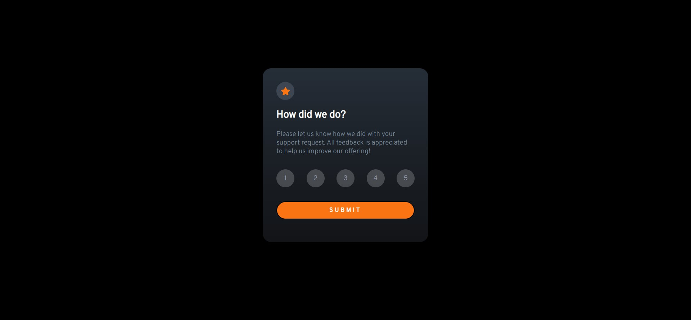
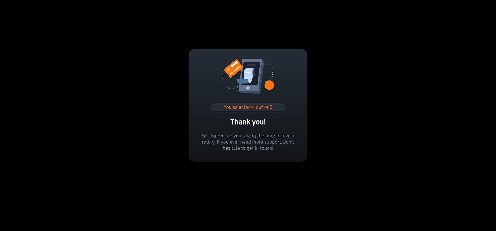

# Frontend Mentor - Interactive rating component solution

This is a solution to the [Interactive rating component challenge on Frontend Mentor](https://www.frontendmentor.io/challenges/interactive-rating-component-koxpeBUmI). Frontend Mentor challenges help you improve your coding skills by building realistic projects. 

## Table of contents

- [Overview](#overview)
  - [The challenge](#the-challenge)
  - [Screenshot](#screenshot)
  - [Links](#links)
- [My process](#my-process)
  - [Built with](#built-with)
  - [What I learned](#what-i-learned)
  - [Useful resources](#useful-resources)
- [Author](#author)

## Overview

### The challenge

Users should be able to:

- View the optimal layout for the app depending on their device's screen size
- See hover states for all interactive elements on the page
- Select and submit a number rating
- See the "Thank you" card state after submitting a rating

### Screenshot

### Links

- Solution URL: [Add solution URL here](https://your-solution-url.com)
- Live Site URL: [Add live site URL here](https://your-live-site-url.com)

## My process

### Built with

- Semantic HTML5 markup
- CSS custom properties
- Flexbox
- Mobile-first workflow
- Javascript  
- [Font awesome](https://fontawesome.com/)

### What I learned

This project helped me recap over some concepts of CSS and JS such as Flexbox, Mediaqueries, animations, event listerners, DOM manipulation...
To see how you can add code snippets, see below:

### Useful resources

- [Css animations](https://www.w3schools.com/css/css3_animations.asp) - This helped me for learning animations. I really liked this pattern and will use it going forward.
- [Media queries](https://developer.mozilla.org/en-US/docs/Learn/CSS/CSS_layout/Media_queries) - This is an amazing article which helped me finally understand media queries. I'd recommend it to anyone still learning this concept.

## Author

- Website - [MARTIALEAGLE](https://github.com/AshwanthramKL)
- Frontend Mentor - [@AshwanthramKL](https://www.frontendmentor.io/profile/AshwanthramKL)
- Twitter - [@AshwanthramKL](https://www.twitter.com/AshwanthramKL)
